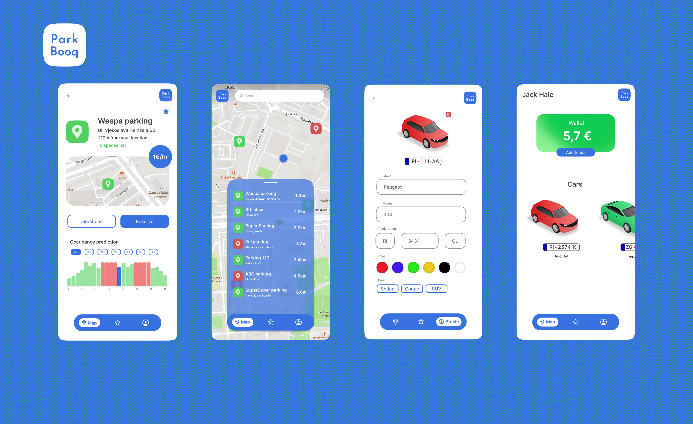
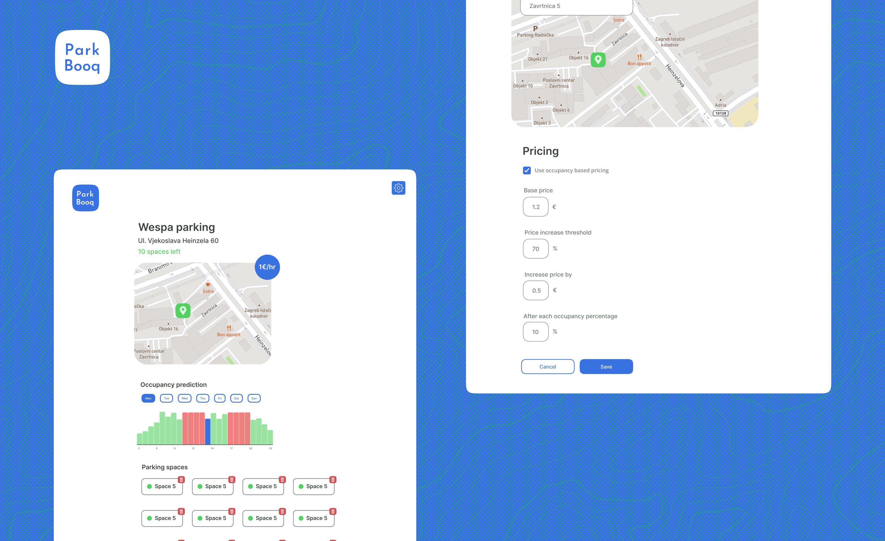

# Parkbooq

### Description
Project created as part of a hackathon. The theme was smart parking and an application for using smart parking. The 
project won first place.

As preparation for the project, we received an external service that simulated parking spots, occupying and releasing 
parking spots. As part of the backend, we created an in-memory database that stored parking data. The backend grouped 
parking spots into clusters, provided location data, and information about available spots in each cluster. The mobile 
application allows viewing clusters and parking spots, entering data about one's car, and directions to the parking spot. 
Additionally, there is a dashboard that enables admins to organize parking spots and manage clusters. Furthermore, for 
each cluster, there is an option to pay for parking using a custom algorithm for calculating the parking fee.

### App Screenshots

### Code
More information about the project can be found in the README files inside the backend, dashboard and mobile-app folders.
